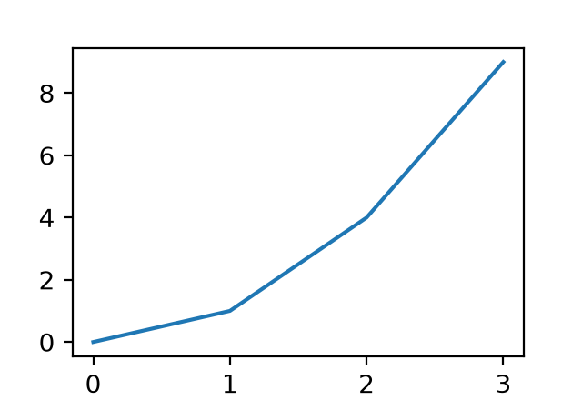

<!-- Generated by scireport <version> (template generic@1, layout default@1) from a bundle with manifest sha256 7112702977a0. Do not edit. -->

# Values

**Number:** 1.23 ± 0.01 arcsec

*Table 1. A Parquet table*

| ID | Redshift | label |
|---:|---:|:---|
| 1 | 0.100 | a |
| 2 | -- | b |
| 3 | 0.300 | c |

*Figure 1. y = x squared*
